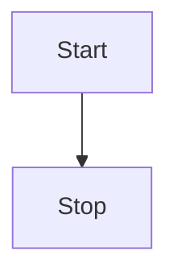

[//]: # (title: Container environments)

The Ray SDK runtime environment can be containerized with Docker to isolate it from other runtime systems. 
To learn more about the container environment, read the Ray SDK Harness container contract.

Prebuilt SDK container images are released per supported language during Beam releases and pushed to Docker Hub.

## Custom containers

You may want to customize container images for many reasons, including:

- Pre-installing additional dependencies
- Launching third-party software in the worker environment
- Further customizing the execution environment
- This guide describes how to create and use customized containers for the Beam SDK.



### Prerequisites

This guide requires building images using Docker. Install Docker locally. Some CI/CD platforms like Google Cloud Build also provide the ability to build images using Docker.
For remote execution engines/runners, have a container registry to host your custom container image. Options include Docker Hub or a “self-hosted” repository, including cloud-specific container registries like Google Container Registry (GCR) or Amazon Elastic Container Registry (ECR). Make sure your registry can be accessed by your execution engine or runner.

> On Nov 20, 2020, Docker Hub put rate limits into effect for anonymous and free authenticated use, which may impact larger pipelines that pull containers several times.
>
{style="note"}

For optimal user experience, we also recommend you use the latest released version of Beam.

### Building and pushing custom containers

Ray SDK container images are built from Dockerfiles checked into the GitHub repository and published to Docker Hub for every release. 
You can build customized containers in one of three ways:

1. Writing a new Dockerfile based on a released container image. This is sufficient for simple additions to the image, such as adding artifacts or environment variables.
2. Modifying a source Dockerfile in Beam. This method requires building from Beam source but allows for greater customization of the container (including replacement of artifacts or base OS/language versions).
3. Modifying an existing container image to make it compatible with Apache Beam Runners. This method is used when users start from an existing image, and configure the image to be compatible with Apache Beam Runners.

#### Writing a new Dockerfile based on an existing published container image

1. Create a new Dockerfile that designates a base image using the FROM instruction.
```dDocker
FROM apache/beam_python3.7_sdk:2.25.0

ENV FOO=bar
COPY /src/path/to/file /dest/path/to/file/
```
2. Build and push the image using Docker.
```Docker
export BASE_IMAGE="apache/beam_python3.7_sdk:2.25.0"
export IMAGE_NAME="myremoterepo/mybeamsdk"
export TAG="latest"

# Optional - pull the base image into your local Docker daemon to ensure
# you have the most up-to-date version of the base image locally.
docker pull "${BASE_IMAGE}"

docker build -f Dockerfile -t "${IMAGE_NAME}:${TAG}" .
```
3. If your runner is running remotely, retag and push the image to the appropriate repository.
```bash
docker push "${IMAGE_NAME}:${TAG}"
```
4. After pushing a container image, verify the remote image ID and digest matches the local image ID and digest, output from docker build or docker images.
 

#### Modifying a source Dockerfile in Beam

This method requires building image artifacts from Beam source. For additional instructions on setting up your development environment, see the Contribution guide.

<note>It is recommended that you start from a stable release branch (release-X.XX.X) corresponding to the same version of the SDK to run your pipeline. Differences in SDK version may result in unexpected errors.</note>

1. Clone the beam repository.
2. Customize the Dockerfile for a given language, typically <path>sdks/<language>/container/Dockerfile</path> directory (e.g. the Dockerfile for Python.)
3. Return to the root Beam directory and run the Gradle docker target for your image.
4. Verify the images you built were created by running docker images.
5. If your runner is running remotely, retag the image and push the image to your repository. You can skip this step if you provide a custom repo/tag as additional parameters.
6. After pushing a container image, verify the remote image ID and digest matches the local image ID and digest output from `docker_images --digests`.

#### Additional build parameters

The docker Gradle task defines a default image repository and tag is the SDK version defined at gradle.properties. The default repository is the Docker Hub apache namespace, and the default tag is the SDK version defined at gradle.properties.

You can specify a different repository or tag for built images by providing parameters to the build task. For example:

```./gradlew :sdks:python:container:py36:docker -Pdocker-repository-root="example-repo" -Pdocker-tag="2.26.0-custom"
builds the Python 3.6 container and tags it as example-repo/beam_python3.6_sdk:2.26.0-custom.
```

From Beam 2.21.0 and later, a docker-pull-licenses flag was introduced to add licenses/notices for third party dependencies to the docker images. For example:

```
./gradlew :sdks:java:container:java8:docker -Pdocker-pull-licenses
creates a Java 8 SDK image with appropriate licenses in /opt/apache/beam/third_party_licenses/.
```

By default, no licenses/notices are added to the docker images.

#### Modifying an existing container image to make it compatible with Apache Beam Runners

Beam offers a way to provide your own custom container image. The easiest way to build a new custom image that is compatible with Apache Beam Runners is to use a multi-stage build process. 
This copies over the necessary artifacts from a default Apache Beam base image to build your custom container image.
 
1. Copy necessary artifacts from Apache Beam base image to your image.
2. Build and push the image using Docker.
3. If your runner is running remotely, retag the image and push the image to your repository.
```Bash
docker push "${IMAGE_NAME}:${TAG}"
```

### Running pipelines with custom container images

The common method for providing a container image requires using the PortableRunner flag <code>--environment_config</code> as supported by the Portable Runner or by runners supported PortableRunner flags. 
Other runners, such as Dataflow, support specifying containers with different flags.

<tabs>
<tab title="Direct">
```
export IMAGE="my-repo/beam_python_sdk_custom"
export TAG="X.Y.Z"
export IMAGE_URL = "${IMAGE}:${TAG}"

python -m apache_beam.examples.wordcount \
--input=/path/to/inputfile \
--output /path/to/write/counts \
--runner=PortableRunner \
--job_endpoint=embed \
--environment_type="DOCKER" \
--environment_config="${IMAGE_URL}"
```
</tab>
<tab title="Flink">
```
export IMAGE="my-repo/beam_python_sdk_custom"
export TAG="X.Y.Z"
export IMAGE_URL = "${IMAGE}:${TAG}"

# Run a pipeline using the FlinkRunner which starts a Flink job server.
python -m apache_beam.examples.wordcount \
--input=/path/to/inputfile \
--output=path/to/write/counts \
--runner=FlinkRunner \
# When running batch jobs locally, we need to reuse the container.
--environment_cache_millis=10000 \
--environment_type="DOCKER" \
--environment_config="${IMAGE_URL}"
```
</tab>
<tab title="Spark">
```
export IMAGE="my-repo/beam_python_sdk_custom"
export TAG="X.Y.Z"
export IMAGE_URL = "${IMAGE}:${TAG}"

# Run a pipeline using the SparkRunner which starts the Spark job server
python -m apache_beam.examples.wordcount \
--input=/path/to/inputfile \
--output=path/to/write/counts \
--runner=SparkRunner \
# When running batch jobs locally, we need to reuse the container.
--environment_cache_millis=10000 \
--environment_type="DOCKER" \
--environment_config="${IMAGE_URL}"
```
</tab>
<tab title="Dataflow">
```
export GCS_PATH="gs://my-gcs-bucket"
export GCP_PROJECT="my-gcp-project"
export REGION="us-central1"

# By default, the Dataflow runner has access to the GCR images
# under the same project.
export IMAGE="my-repo/beam_python_sdk_custom"
export TAG="X.Y.Z"
export IMAGE_URL = "${IMAGE}:${TAG}"

# Run a pipeline on Dataflow.
# This is a Python batch pipeline, so to run on Dataflow Runner V2
# you must specify the experiment "use_runner_v2"

python -m apache_beam.examples.wordcount \
--input gs://dataflow-samples/shakespeare/kinglear.txt \
--output "${GCS_PATH}/counts" \
--runner DataflowRunner \
--project $GCP_PROJECT \
--region $REGION \
--temp_location "${GCS_PATH}/tmp/" \
--experiment=use_runner_v2 \
--sdk_container_image=$IMAGE_URL
```
</tab>
</tabs>
 

### Troubleshooting

The following section describes some common issues to consider when you encounter unexpected errors running Beam pipelines with custom containers.

- Differences in language and SDK version between the container SDK and pipeline SDK may result in unexpected errors due to incompatibility. For best results, make sure to use the same stable SDK version for your base container and when running your pipeline.
- If you are running into unexpected errors when using remote containers, make sure that your container exists in the remote repository and can be accessed by any third-party service, if needed.
- Local runners attempt to pull remote images and default to local images. If an image cannot be pulled locally (by the docker daemon), you may see an log message like:

```bash 
Error response from daemon: manifest for remote.repo/beam_python3.7_sdk:2.25.0-custom not found: manifest unknown: ...
INFO:apache_beam.runners.portability.fn_api_runner.worker_handlers:Unable to pull image...
```